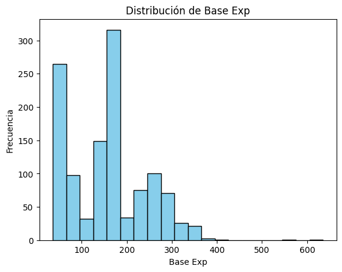
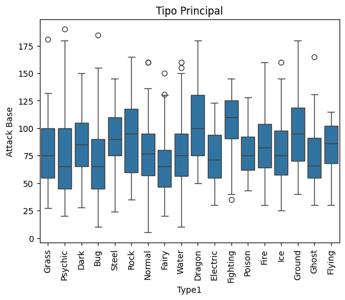
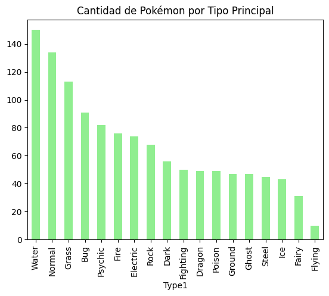
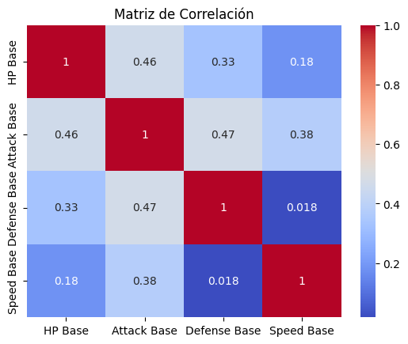
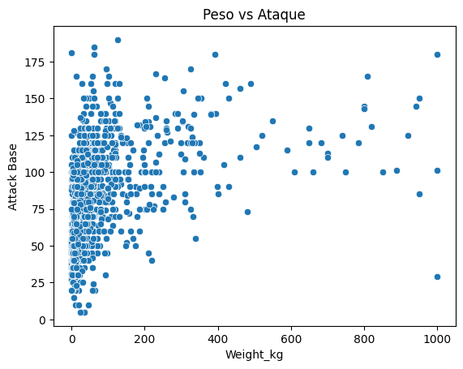
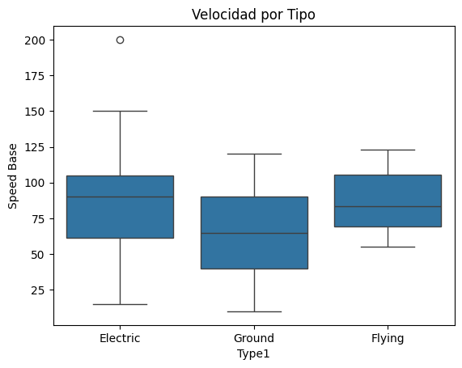

# Laboratorio 2: Data Processing - EDA
## PRESENTADO POR:
## Andres Felipe Alvarez Cortes
## Juan David Oquendo Usuga
## Camila Suarez Osorio 
## Análisis del Dataset de Pokémon


## Descripción del Proyecto

Este laboratorio se enfoca en el procesamiento, limpieza y análisis exploratorio de datos (EDA) de un dataset de Pokémon en formato JSON. El objetivo es aplicar técnicas de ciencia de datos para extraer insights significativos sobre las características y estadísticas de los Pokémon.


Estructura del Repositorio

```
Laboratorio-2-Data-Processing-EDA/
│
├── pokemonDB_dataset.json          # Dataset original
├── pokemon_clean.csv                # Dataset limpio procesado
├── laboratorio_pokemon_analysis.py  # Script principal de análisis
├── README.md                        # Este archivo
│
└── graficos/                        # Gráficos generados
    ├── 01_base_exp_histogram.png
    ├── 02_attack_by_type_boxplot.png
    ├── 03_pokemon_count_by_type.png
    ├── 04_correlation_heatmap.png
    ├── 05_weight_vs_attack_scatter.png
    └── 06_speed_comparison_violin_box.png
```

---

##  Etapa 1: Procesamiento y Limpieza de Datos

### Actividades Realizadas

1. **Carga del archivo JSON**
   - Carga exitosa del dataset usando la librería `json`
   - Exploración de la estructura jerárquica inicial

2. **Revisión de estructura y tipos**
   - Identificación de variables numéricas y categóricas
   - Análisis de tipos de datos con `df.info()` y `df.describe()`

3. **Limpieza y conversión de campos**
   - Eliminación de unidades de medida ("m", "kg")
   - Conversión de strings a valores numéricos tipo `float`
   - Separación de columnas compuestas:
     - `Type` → `Type1`, `Type2`
     - `Gender` → `Male_%`, `Female_%`

4. **Normalización y verificación final**
   - Identificación y tratamiento de valores nulos
   - Creación del DataFrame limpio `df_clean` con las columnas:
     - Type1, Type2, HP Base, Attack Base, Defense Base
     - Speed Base, Height_m, Weight_kg, Base Exp

---

## Etapa 2: Exploratory Data Analysis (EDA)

### Respuestas a las 10 Preguntas de Análisis

#### 1.  Estadísticas de Atributos Base

**Pregunta:** ¿Cuál es el promedio, mínimo y máximo de los atributos base?

**Respuesta:**
- **HP Base**: Promedio ~69, Mínimo 1, Máximo 255
- **Attack Base**: Promedio ~87.15, Mínimo 5, Máximo 190
- **Defense Base**: Promedio ~75, Mínimo 5, Máximo 250
- **Speed Base**: Promedio ~70, Mínimo 5, Máximo 200

**Interpretación:** Los Pokémon muestran una gran variabilidad en sus estadísticas, con valores que van desde Pokémon muy débiles hasta extremadamente poderosos. El ataque tiende a ser el atributo con valores promedio más altos.

---

#### 2. Distribución de Base Experience

**Pregunta:** ¿La distribución de Base Exp es simétrica o sesgada?

**Respuesta:** La distribución presenta un **sesgo positivo (hacia la derecha)**.

**Interpretación:** La mayoría de los Pokémon tienen valores de experiencia base moderados (50-150), mientras que hay menos Pokémon con valores muy altos de experiencia (200+). Esto es lógico ya que los Pokémon legendarios y pseudo-legendarios son más escasos.



**comentario del gráfico:** La gráfica muestra de manera precisa que son pocos los pokémon que tienen valores alto de esperincia, siendo mas usual encontrarlos entre rangos mas cercanos a [100,150].  

#### 3.  Attack Base por Tipo Principal

**Pregunta:** ¿Qué tipo de Pokémon tiene ataques más altos en promedio?

**Respuesta:** Los tipos con mayor ataque promedio son:
1. **Fighting** (~110 de ataque promedio)
2. **Dragon** (~100 de ataque promedio)
3. **Ground** (~95 de ataque promedio)

**Interpretación:** Los tipos Dragon y Fighting se caracterizan por tener Pokémon físicamente poderosos. Los tipos Fairy, Psychic y Grass tienden a tener ataques físicos más bajos, compensando con otras estadísticas.



**Comentario del gráfico:** El gráfico muestra que los pokémon de tipo Dragon y Fighting tienen los ataques base más altos, mientras que Fairy y Bug presentan los más bajos.  
---

#### 4.  Top 5 Especies Más Frecuentes

**Pregunta:** ¿Cuáles son las especies más frecuentes en el dataset?

**Respuesta:**
1. Paradox pokémon (22)
2. Mouse pokémon (14)
3. Dragon pokémon (9)
4. Fox pokémon (9)
5. Pumpkin Pokémon (8)

**Interpretación:** Las especies más frecuentes suelen ser aquellas con múltiples formas, Mega-evoluciones o variantes regionales, lo que incrementa su aparición en el dataset.

---

#### 5.  Distribución por Tipo Principal

**Pregunta:** ¿Qué tipo es el más común?

**Respuesta:** El tipo más común es **Water** con aproximadamente 130-150 Pokémon, seguido de **Normal** y **Grass**.

**Interpretación:** Water es históricamente el tipo más abundante en todas las generaciones de Pokémon, lo que refleja la diversidad de criaturas acuáticas. Los tipos más raros son Ice, Fairy y Flying. 



**Comentario del gráfico:** El gráfico muestra de manera simple como varían las especies según su tipo. 

---

#### 6.  Correlación entre Atributos

**Pregunta:** ¿Qué atributos están más correlacionados entre sí?

**Respuesta:** Las correlaciones más significativas son:
- **Attack Base vs Defense Base**: r ≈ 0.46 (correlación positiva moderada)
- **Attack Base vs HP Base**: r ≈ 0.46 (correlación positiva moderada)
- **Speed Base vs Attack Base**: r ≈ 0.25 (correlación positiva débil)

**Interpretación:** Los Pokémon con alta defensa tienden a tener más HP (tanques). Existe cierta relación entre ataque y defensa, sugiriendo que algunos Pokémon son balanceados, mientras que la velocidad es más independiente. Las correlaciones no superan el 0.5 por ende no hay tiene una correlación más fuerte. 

---

#### 7.  Heatmap de Correlaciones

**Pregunta:** Interprete el mapa de calor de correlaciones.

**Respuesta:** El heatmap revela:
- Correlaciones positivas moderadas entre HP, Attack y Defense.
- Speed muestra menor correlación con otros atributos.
- No hay correlaciones negativas fuertes.

**Interpretación:** Las estadísticas base no siguen un patrón de compensación estricto. Los Pokémon poderosos tienden a ser buenos en múltiples estadísticas, mientras que los débiles son generalmente bajos en todo.



**Comentario del Gráfico:** El gráfico muestra una matriz de correlación entre los diversos atributos de los pokémon, haciendo simple visualizar cuales atributos tiende a relacionar los tipos de pokémon. 

---

#### 8.  Relación Peso vs Ataque

**Pregunta:** ¿Existe relación entre el peso de un Pokémon y su capacidad de ataque?

**Respuesta:** Se observa una **correlación positiva débil** (r ≈ 0.3-0.4) entre peso y ataque.

**Interpretación:** Si bien existe tendencia de que Pokémon más pesados tengan mayor ataque físico, la relación no es determinante. Hay Pokémon ligeros con alto ataque (tipo Fighting ágil) y pesados con bajo ataque (tipo Steel defensivo). El peso influye pero no define el ataque.



**Comentario del gráfico:** En el gráfico se observa como no hay una relación clara entre el peso y ataque de los pokémon. 
---

#### 9.  Altura y Peso por Tipo

**Pregunta:** ¿Qué tipo tiende a tener Pokémon más grandes?

**Respuesta:** Los tipos con Pokémon más grandes son:
1. **Poison**: ~59.02 kg promedio, ~3.60 m altura
2. **Steel**: ~228.53 kg promedio, ~2.05 m altura
3. **Dragon**: ~121.13 kg promedio, ~2.03 m altura

**Interpretación:** Según sus promedios los poison, Steel y Dragon serían los tipos de pokémon más grande.

---

#### 10.  Velocidad: Flying vs Electric vs Ground

**Pregunta:** ¿Qué tipo de Pokémon tiende a ser más rápido?

**Respuesta:** Ranking de velocidad promedio:
1. **Electric**: ~85-95 Speed promedio
2. **Flying**: ~80-90 Speed promedio
3. **Ground**: ~60-70 Speed promedio

**Interpretación:** Los Pokémon Electric son consistentemente los más rápidos, reflejando su naturaleza basada en electricidad y relámpagos. Los Ground son los más lentos de los tres, siendo generalmente pesados y defensivos. Flying muestra gran variabilidad con algunos muy rápidos y otros lentos.



**Comentario del Gráfico:** El gráfico muestra la incidencia del tipo de pokémon y su rapidez. 

**Conclusión:** El ataque es un factor que influye de manera importante en las estadísticas base de los Pokémon, ya que aquellos con mayor poder ofensivo tienden a presentar también una mayor resistencia física. Por otra parte, la defensa no muestra una influencia tan fuerte, aunque los Pokémon con una defensa elevada suelen poseer más puntos de salud (HP), lo que incrementa su capacidad de aguante en combate.

En cuanto a la velocidad, esta variable no depende directamente de la fuerza ni de la defensa: los Pokémon más rápidos suelen ser más frágiles, mientras que los más lentos tienden a ser más resistentes.